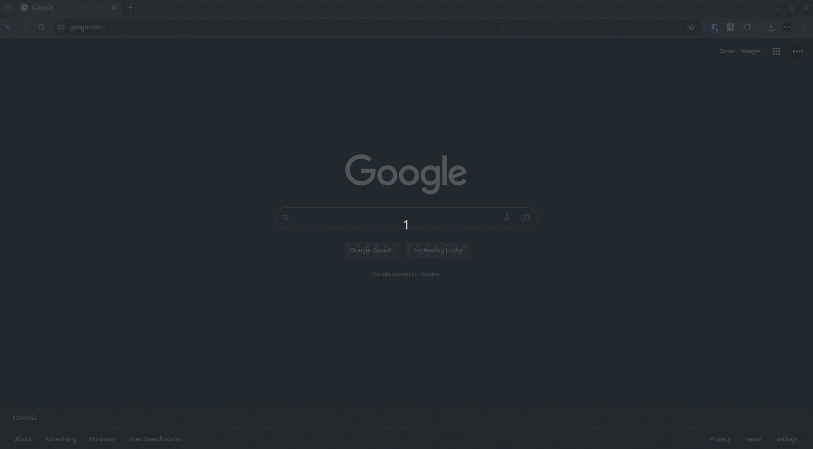

# Jimp | Jump to a Jira issue easily

### Description
Jimp is a Google Chrome extension that allows you to jump to a Jira issue easily. It shows a list of recent issues and allows you to jump to the issue you want.

You can define the Jira URL and the issue key you want to jump to.

### Download and Install

1. Download the [ZIP package](https://gitlab.ii.zone/behzad.amirinezhad/jimp/-/archive/master/jimp-master.zip) and extract it to somewhere.
2. Open Google Chrome and go to chrome://extensions/.
3. Enable "Developer mode" by clicking the toggle switch.
4. Click "Load unpacked" and select the extension directory.

### Demo

### Usage

1. Click on the Jimp icon or press `Alt+J` to open the popup.
2. Enter the Jira URL and the issue key.
3. Click "Jump" or press Enter.

### Options

- **Jira URL**: The URL of your Jira instance.
- **Jira Issue Key**: The key of the issue you want to jump to.
- **Max Recent Issues**: The maximum number of recent issues to show.

### Changelog
* **Version 1.3**
  * Added options to configure Jira URL and issue key.
  * Added a list of recent issues and settings to configure the maximum number of recent issues to show.
  * Added Setting shortcut to open the options page.
